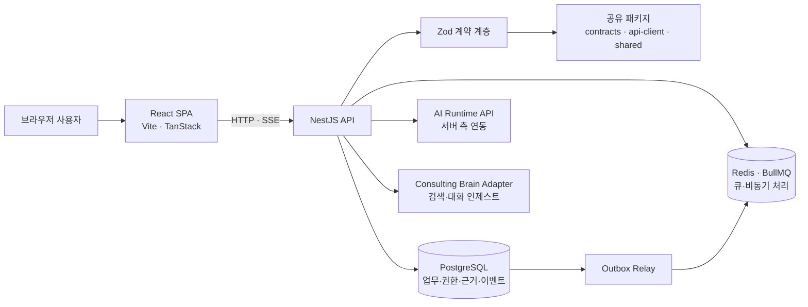

# Consulting Web

컨설팅 프로젝트의 대화, 근거, 문서, 판단 과정을 하나의 작업공간에서 연결하는 AI 협업 웹 애플리케이션입니다. 단순 채팅 UI를 넘어 **프로젝트 맥락을 유지하고, 답변의 근거를 검토하며, 결과물을 추적 가능한 형태로 관리하는 것**을 목표로 합니다.

## 주요 기능

- **계층형 프로젝트 공간** — workspace → project → channel → topic → thread 구조로 업무 맥락을 분리합니다.
- **실시간 AI 대화** — NestJS가 AI 런타임을 서버 측에서 호출하고, 타입이 검증된 SSE 이벤트로 브라우저에 전달합니다.
- **근거 중심 검토** — 대화·파일·evidence를 연결하고, 주장 검증·인용 확인·정확성 게이트를 위한 백엔드 서비스를 제공합니다.
- **문서 및 산출물 관리** — 업로드, 문서 추출, 라이브러리, 버전형 산출물 흐름을 지원합니다.
- **컨텍스트 그래프** — 트리 구조 위에 태그와 관계 edge를 더해 연관 범위를 탐색하고 검색 컨텍스트를 조립합니다.
- **협업과 접근 제어** — 회원가입, 로그인, 초대 링크, workspace membership과 역할 기반 권한을 제공합니다.
- **복구 가능한 상태 전이** — 보관·복원, soft-delete, audit/outbox를 통해 사용자 작업과 비동기 처리를 추적합니다.
- **웹 사용성** — 가상화된 메시지 목록, 검색, Markdown·수식·Mermaid 렌더링, 오프라인 상태 표시와 Web Push 기반을 포함합니다.

## 아키텍처



브라우저는 애플리케이션 API만 호출하며 AI 런타임 자격 증명과 데이터베이스 자격 증명을 받지 않습니다. API 계약, DB 스키마, 클라이언트 타입을 workspace package로 분리해 변경 경계를 명확히 했습니다.

## Engineering highlights

- **Contract-first 경계** — `packages/contracts`의 strict Zod schema를 API 응답, 오류, SSE 이벤트의 공통 계약으로 사용합니다.
- **Workspace-first 멀티테넌시** — 주요 도메인 데이터에 workspace 경계를 두고 membership과 ancestor chain을 함께 확인합니다.
- **트리 + 그래프 모델** — 업무 계층은 명확한 부모-자식 구조로 유지하면서, `context_edges`와 `scope_tags`로 횡단 참조를 표현합니다.
- **트랜잭션과 비동기 전달 분리** — 도메인 변경과 outbox 기록을 묶고 BullMQ relay가 후속 작업을 전달합니다.
- **타입 안전 스트리밍** — AI 런 이벤트를 애플리케이션 SSE 계약으로 변환하고, 브라우저 클라이언트가 동일 schema를 기준으로 소비합니다.
- **근거에서 결정까지의 파이프라인** — evidence 수집, 충분성 평가, claim verifier, citation post-check, exactness gate를 독립 서비스로 구성합니다.
- **수명주기 보존** — archive, soft-delete, restore를 구분하고 관련 그래프 데이터와 상태 전이를 함께 다룹니다.
- **모노레포 경계 검사** — pnpm workspace와 Turborepo로 앱·계약·DB·클라이언트 패키지의 build/typecheck 순서를 관리합니다.

## 기술 스택

| 영역 | 기술 |
|---|---|
| Frontend | React 19, TypeScript, Vite, TanStack Router/Query/Virtual, Tailwind CSS, Radix UI |
| Backend | NestJS 11, Zod, RxJS, Server-Sent Events |
| Data | PostgreSQL 16, Drizzle ORM |
| Async | Redis 7, BullMQ, transactional outbox |
| Document/UI | PDF.js, React Markdown, KaTeX, Mermaid, Shiki |
| Tooling | pnpm 11, Turborepo, ESLint, Vitest, TypeScript |
| Deployment | Docker Compose, nginx |

## 검증 가능한 빠른 시작

아래 절차는 저장소의 `package.json`, `.env.example`, `docker-compose.local.yml`, DB package script에 존재하는 명령만 사용합니다.

### 준비물

- Node.js 20 이상
- pnpm 11.10.0
- Docker와 Docker Compose
- 로컬에서 접근 가능한 호환 AI Runtime API

```bash
# 1. 환경변수 준비
cp .env.example .env.local
# .env.local의 placeholder를 로컬 값으로 교체합니다.

# 2. 의존성 설치
pnpm install --frozen-lockfile

# 3. 환경변수를 현재 shell에 로드하고 PostgreSQL/Redis 시작
set -a
. ./.env.local
set +a
docker compose -f docker-compose.local.yml up -d

# 4. workspace 빌드와 DB migration
pnpm build
pnpm --filter @consulting/db-schema drizzle:migrate

# 5. API와 Web 개발 서버 시작
pnpm dev
```

개발 서버 주소는 실행 시 출력되는 Vite/Nest 로그를 기준으로 확인합니다. 실제 자격 증명이나 운영 데이터는 예제 파일에 넣지 마세요.

## 품질 관리

루트 manifest가 제공하는 표준 게이트는 다음과 같습니다.

```bash
pnpm lint
pnpm typecheck
pnpm test
pnpm build
```

DB/Redis 환경변수가 없는 경우 해당 의존성이 필요한 통합 테스트는 테스트 코드의 조건에 따라 skip될 수 있으므로, 전체 통합 검증은 로컬 인프라를 기동한 뒤 실행해야 합니다.

## 보안 및 데이터 경계

- 브라우저는 AI Runtime, PostgreSQL, Redis의 자격 증명에 직접 접근하지 않습니다.
- secret은 커밋하지 않고 환경변수 또는 로컬 `.env.*` 파일로 주입합니다.
- workspace membership과 scope ancestor 검증을 서버 측 접근 경계로 사용합니다.
- 업로드 문서, 대화, 근거, 산출물은 애플리케이션 데이터로 취급하며 공개 저장소의 fixture나 문서에 실제 고객 데이터를 포함하면 안 됩니다.
- 외부 AI·embedding 공급자를 연결할 때는 전송 데이터, 보존 정책, 지역 규정을 별도로 검토해야 합니다.


## 현재 상태

이 저장소는 이력서·포트폴리오 검토를 위한 source snapshot이며, 핵심 애플리케이션 구조와 기능은 구현되어 있습니다. 외부 AI Runtime, 실제 embedding 공급자, 운영 배포 환경이 필요한 end-to-end 검증은 별도 환경 구성 없이는 재현되지 않습니다.
